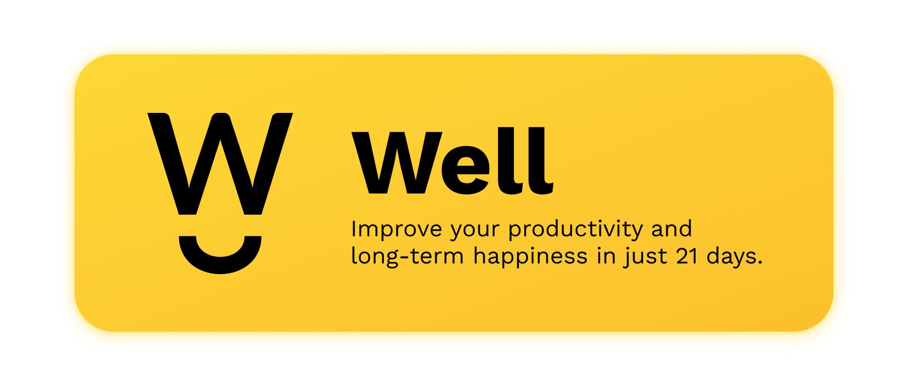

  

  

  

 

---

  
### Quick Links
  

  

  

  
 
  
 
  

  

---

### The Well app is available for download! 🥳 🚀

- iOS/macOS: Search for "well: reboot your mindset" on the [iOS app store](https://apps.apple.com/us/app/well-reboot-your-mindset/id1573357406).
- Web: Visit [https://well-app.netlify.app](https://well-app.netlify.app). Install as a PWA for native-like functionality!
- Android: coming soon 👀

---

 

**[PROJECT PHILOSOPHY](https://github.com/chroline/well_app#-project-philosophy) • 
[TECH STACK](https://github.com/chroline/well_app#-tech-stack) • 
[CONTRIBUTING](https://github.com/chroline/well_app#%EF%B8%8F-contributing) • 
[SPREAD THE WORD](https://github.com/chroline/well_app#-spread-the-word) • 
[LICENSE](https://github.com/chroline/well_app#%EF%B8%8F-license)**

 

# 🧐 Project philosophy

> The Well app is a mental health and mindfulness app built on top of the science of positive psychology. The Well app is more than just another meditation or journaling app; it encourages you to enhance and reflect on your day with structured, guided activities.
> 
> There are 5 daily tasks that the Well app asks you to complete each day: record 3 gratitudes, write a journal entry, perform 3 acts of kindness, exercise for 20 minutes, and meditate for 15 minutes.

**Read more about the Well app on [the project homepage](https://projects.colegaw.in/well-app?utm_source=GitHub&utm_medium=readme&utm_campaign=well_app_readme).**

# 👨‍💻 Tech stack

Here's a brief high-level overview of the tech stack the Well app uses:

- This project uses the [Flutter app development framework](https://flutter.dev/). Flutter is a cross-platform hybrid app development platform which allows us to use a single codebase for apps on mobile, desktop, and the web.
- For persistent storage (database), the app uses the [Hive](https://hivedb.dev/) package which allows the app to create a custom storage schema and save it to a local database.
- To send local push notifications, the app uses the [flutter_local_notifications](https://pub.dev/packages/flutter_local_notifications) package which supports Android, iOS, and macOS.
- The app uses the font ["Work Sans"](https://fonts.google.com/specimen/Work+Sans) as its main font, and the design of the app adheres to the material design guidelines.

# ✍️ Contributing

Interested in contributing to the Well app project? Thanks so much for your interest! We are always looking for improvements to the project and contributions from open-source developers are greatly appreciated.

If you have a contribution in mind, please check out our [Contribution Guide](https://github.com/chroline/well_app/wiki/Contribution-Guide) for information on how to do so. Also, make sure you read our [Code of Conduct](https://github.com/chroline/well_app/wiki/Code-of-Conduct) to foster an encouraging sense of community.

# 🌟 Spread the word!

If you want to say thank you and/or support active development of the Well app:

- Add a GitHub Star to the project!
- Tweet about the project on your Twitter!
  - Tag [@colegawin_](https://twitter.com/colegawin_) and/or `#thewellapp`
- Leave us a review [on the iOS App Store](https://apps.apple.com/us/app/well-reboot-your-mindset/id1573357406)!

Thanks so much for your interest in growing the reach of the Well app!

# ⚠️ License

The Well app is free and open-source software licensed under the GNU General Public License v3.0. All designs were created by [Cole Gawin](https://github.com/chroline) and distributed under Creative Commons license (CC BY-SA 4.0 International).

 

---

 

# 💛

Reminder that *you are great, you are enough, and your presence is valued.* If you are struggling with your mental health, please reach out to someone you love and consult a professional. [There are many resources for you to get help in a time of need.](https://www.nimh.nih.gov/health/find-help)
